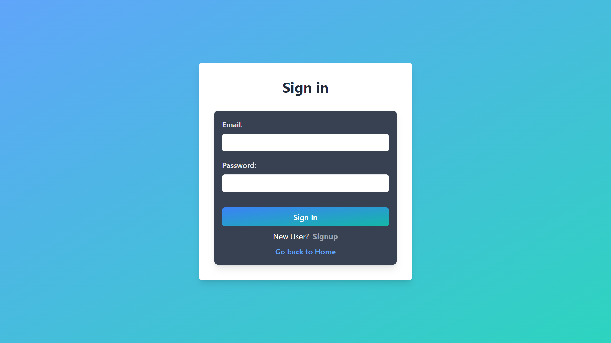

# wd301-capstone project
# As part of my capstone project, I built a React application called sports-app.

This application enables users to access sports news articles, real-time match scores, and match details, while also offering personalization options for a tailored dashboard, including selecting favorite sports and teams for customized updates.

Features:
* Browse sports news with titles, summaries, and thumbnails.
* Filter news articles by sport with dynamic updates.
* View live scores, match details, and refresh scores.
* Personalize the dashboard by creating accounts and customizing preferences.
* Access live scores and trending news on the landing page.
* Filter news by sport and team selections.
* Sign-in and sign-up pages for user registration.
* Users can change their password.
* Detailed news article view with images and content.
* Preferences screen for sport and team selection.
* Filter news based on user preferences.
* Users can see favorite news articles based on selected sport and team.

## Screenshots of application
